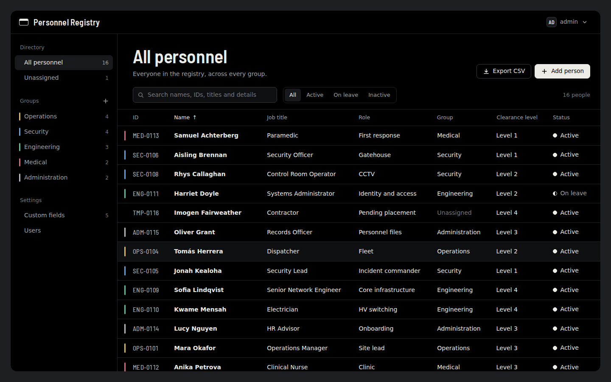

# Personnel Registry

A self-hosted database and web interface for logging personnel: who they are,
what they do, which group they belong to, and any extra details you decide to
track. Deploys as a Docker stack, managed from Portainer.



## What it does

- **Groups.** Create, rename, recolour, reorder and delete groups. Each one gets
  its own view, its own colour and an optional short code.
- **Custom fields.** Add fields at any time without touching the schema. A field
  can apply to everyone or to a single group. Types: short text, long text,
  number, date, dropdown, yes/no, email, phone and link.
- **Search, filter, sort and export.** Search across names, IDs, job titles,
  contact details and custom values. Filter by status. Export what you're
  looking at to CSV.
- **Accounts.** Sign-in is required. Add and remove users, reset passwords.
- **Either database.** PostgreSQL or MariaDB, chosen by which compose file you
  deploy.

Schema changes are applied automatically when the app container starts, so
updating is just pulling a new image and redeploying.

---

## Deploying with Portainer

### 1. Publish the image

Fork or push this repository to GitHub. The included workflow
(`.github/workflows/publish.yml`) builds the image for amd64 and arm64 and
publishes it to GitHub Container Registry on every push to `main`. Nothing to
configure.

After the first run, make the package public: **your profile → Packages →
personnel-registry → Package settings → Change visibility → Public**. If you'd
rather keep it private, add a registry in Portainer under **Registries** with a
GitHub personal access token that has `read:packages`.

### 2. Create the stack

In Portainer: **Stacks → Add stack → Repository**.

| Field | Value |
| --- | --- |
| Name | `personnel-registry` |
| Repository URL | `https://github.com/<you>/personnel-registry` |
| Repository reference | `refs/heads/main` |
| Compose path | `compose.yaml` for PostgreSQL, `compose.mariadb.yaml` for MariaDB |

Turn on **GitOps updates** if you want Portainer to redeploy by itself. Polling
every few hours is fine; a webhook is faster if you want pushes to go live
immediately.

### 3. Set the environment variables

Under **Environment variables** on the same page, add:

| Name | Value |
| --- | --- |
| `DB_PASSWORD` | any strong password you like — this is the only one you must set |
| `APP_IMAGE` | `ghcr.io/<you>/personnel-registry:latest` |

That's the minimum. The rest of the table further down is optional.

`APP_IMAGE` exists so you don't have to edit the compose file. The default in
the file points at a placeholder owner and won't resolve.

### 4. Deploy, then read the log for your password

Deploy the stack, then open **Containers → `personnel-registry-app-1` → Logs**.
The first time it starts, it prints:

```
================================================================
  First account created.
    Username: admin
    Password: <generated>
  Sign in and change it. This is the only time it is shown.
================================================================
```

Sign in and change it. If you'd rather set the password yourself, add
`ADMIN_PASSWORD` as an environment variable before the first deploy.

You don't need to invent a `SECRET_KEY`. The app generates one on first start
and keeps it in the database, so sessions survive a redeploy.

### 5. Open it

**Use the 8060 URL**, not 5060. See the next section for why.

---

## About port 5060

The stack publishes the web interface on **5060 as specified**, and also on
**8060**. Both serve the same thing, but 8060 is the one that works in a
browser:

**Browsers refuse to open port 5060.** It is the SIP port, and every major
browser blocks it at the network layer to prevent the NAT Slipstream attack.
Chrome reports `ERR_UNSAFE_PORT` and Firefox says the port was restricted for
security reasons. The application can't work around this, because the request
never leaves the browser. Ports 5060 and 5061 are both on the
[Fetch standard's blocked port list](https://fetch.spec.whatwg.org/#port-blocking).

Three ways to deal with it:

1. **Use 8060**, or set `WEB_ALT_PORT` to whatever you prefer. Simplest.
2. **Unblock 5060 in the browser.** Chrome and Edge accept
   `--explicitly-allowed-ports=5060`, or the `ExplicitlyAllowedNetworkPorts`
   policy for a managed fleet. In Firefox, set
   `network.security.ports.banned.override` to `5060` in `about:config`.
   Per-machine, so it doesn't scale.
3. **Put a reverse proxy in front.** Serve it on 443 with a certificate and
   forward to the container. Best option beyond a couple of users. Set
   `SESSION_HTTPS_ONLY=true` when you do.

Two more things you'll recognise:

- If anything on the host does VoIP, it already wants 5060 and 5061.
- SIP ALG on a firewall or router in the path can rewrite traffic on 5060. If
  requests misbehave across a link, check that first.

Port 5061 for the database is unaffected — DBeaver and pgAdmin don't apply the
browser's port rules.

---

## Updating

With GitOps updates on, Portainer redeploys by itself. Otherwise: **Stacks →
personnel-registry → Pull and redeploy**, or **Update the stack** with
*Re-pull image* ticked.

Either way the app container runs its migrations on start, so the schema is
brought up to date before it serves anything. Your data stays in its volume.

## Backups

### Automatic, no shell needed

Deploy the optional sidecar in `compose.backup.yaml` alongside the engine file.
It dumps the database on a schedule into the `registry-backups` volume, keeps
the most recent 14 and discards any dump that comes back empty. Tune it with
`BACKUP_INTERVAL_SECONDS` and `BACKUP_KEEP`.

Browse the dumps in Portainer under **Volumes → registry-backups**.

### On demand from Portainer

**Containers → the db container → Console → Connect** (`/bin/sh`), then:

```sh
# PostgreSQL
pg_dump -U personnel -d personnel --clean --if-exists | gzip > /tmp/dump.sql.gz

# MariaDB
mariadb-dump -u personnel -p --single-transaction personnel | gzip > /tmp/dump.sql.gz
```

### From a shell

```bash
./backup.sh                       # ./backups/personnel-<engine>-<stamp>.sql.gz, keeps 30
./restore.sh backups/personnel-postgres-20260101-120000.sql.gz
```

`backup.sh` exits non-zero on an empty dump, so it's safe in cron:

```
15 2 * * * cd /opt/personnel-registry && ./backup.sh >> /var/log/registry-backup.log 2>&1
```

Dumps aren't interchangeable between PostgreSQL and MariaDB. `restore.sh`
checks the filename and refuses a mismatch.

## Connecting a database client

The database listens on `127.0.0.1:5061` by default. To reach it from another
machine, set `DB_BIND_ADDRESS` to the host's LAN address and redeploy.
Credentials are `DB_USER` and `DB_PASSWORD`.

Worth remembering: Docker publishes ports by writing its own rules, which
bypass UFW. Binding to a specific address or filtering upstream is what actually
controls this.

## Environment variables

Only `DB_PASSWORD` is required. Set any of these on the stack in Portainer.

| Name | Default | What it does |
| --- | --- | --- |
| `DB_PASSWORD` | — | **Required.** Database password. |
| `APP_IMAGE` | placeholder | The published image to pull. Point it at your repository. |
| `WEB_PORT` | `5060` | Web interface, as specified. Blocked by browsers. |
| `WEB_ALT_PORT` | `8060` | Web interface, the port to use in a browser. |
| `DB_PORT` | `5061` | Database, for external clients. |
| `WEB_BIND_ADDRESS` | `0.0.0.0` | Which interface the web ports listen on. |
| `DB_BIND_ADDRESS` | `127.0.0.1` | Which interface the database port listens on. |
| `APP_TITLE` | `Personnel Registry` | Shown in the header and on the sign-in page. |
| `ADMIN_USERNAME` | `admin` | Username of the first account. |
| `ADMIN_PASSWORD` | generated | Set it to choose the first password yourself. |
| `SECRET_KEY` | generated | Session key. Leave unset. |
| `SESSION_HOURS` | `12` | How long a sign-in lasts. |
| `SESSION_HTTPS_ONLY` | `false` | Set to `true` behind an HTTPS proxy. |
| `DB_NAME` / `DB_USER` | `personnel` | Database name and user. |
| `BACKUP_INTERVAL_SECONDS` / `BACKUP_KEEP` | `86400` / `14` | Backup sidecar only. |

Switching engines means deploying the other compose file, which points at a
different, empty database. It does not move your data.

## Deploying from a shell instead

```bash
git clone https://github.com/<you>/personnel-registry.git
cd personnel-registry
./install.sh
```

The installer generates the database password, writes `.env`, pulls the image
and starts the stack. Re-running it is safe: an existing `.env` is kept and only
missing values are filled in. `./update.sh` pulls and restarts.

To build locally rather than pull:

```bash
docker compose -f compose.yaml -f compose.build.yaml up -d --build
```

In Portainer that only works for a stack deployed from a Git repository; a
pasted stack has no build context.

## How it's put together

```
app/
  registry/
    main.py          FastAPI app, pages, error handling, security headers
    bootstrap.py     waits for the database, migrates, generates secrets
    models.py        tables
    routers/         the API
    static/, templates/   the interface
  migrations/        Alembic, one revision per schema change
compose.yaml         PostgreSQL stack
compose.mariadb.yaml MariaDB stack
compose.build.yaml   build from source instead of pulling
compose.backup.yaml  optional scheduled dumps
.github/workflows/publish.yml   builds and publishes to GHCR
```

Python 3.13, FastAPI, SQLAlchemy 2.0 and Alembic on the back end. The front end
is plain ES modules and CSS with no build step, so what's in the repo is what
runs in the browser.

Custom field *definitions* live in their own table. Their *values* live in a
JSON column on each person — `JSONB` on PostgreSQL, `JSON` on MariaDB. That's
what lets you add a field without a migration. Deleting a field removes its
stored values from every record.

Passwords are hashed with Argon2. Sessions are signed cookies carrying a
fingerprint of the password hash, so changing a password signs out that
account's other sessions. Repeated failed sign-ins are throttled per client and
username. CSV export escapes cells that spreadsheets would treat as formulas.

The PostgreSQL image is pinned to 18 deliberately: 18 moved `PGDATA` and changed
its declared volume, and the compose file mounts the new path. An unpinned image
crossing that boundary would either fail to start or quietly initialise an empty
database.

### Changing the schema

Edit `app/registry/models.py`, then generate a revision:

```bash
docker compose exec app alembic revision --autogenerate -m "add a thing"
```

Review the file under `app/migrations/versions/` before committing it. It runs
on the next start.

## Tested against

PostgreSQL and MariaDB, with the same end-to-end suite passing on both: schema
matching the models, session key generation and reuse, custom field validation,
group reassignment and deletion, search, CSV escaping, session handling, login
throttling and migration rollback. See `tests/`.

## Licence

MIT for the application. The bundled Barlow Semi Condensed font is licensed
under the SIL Open Font License; see `app/registry/static/fonts/OFL.txt`.
